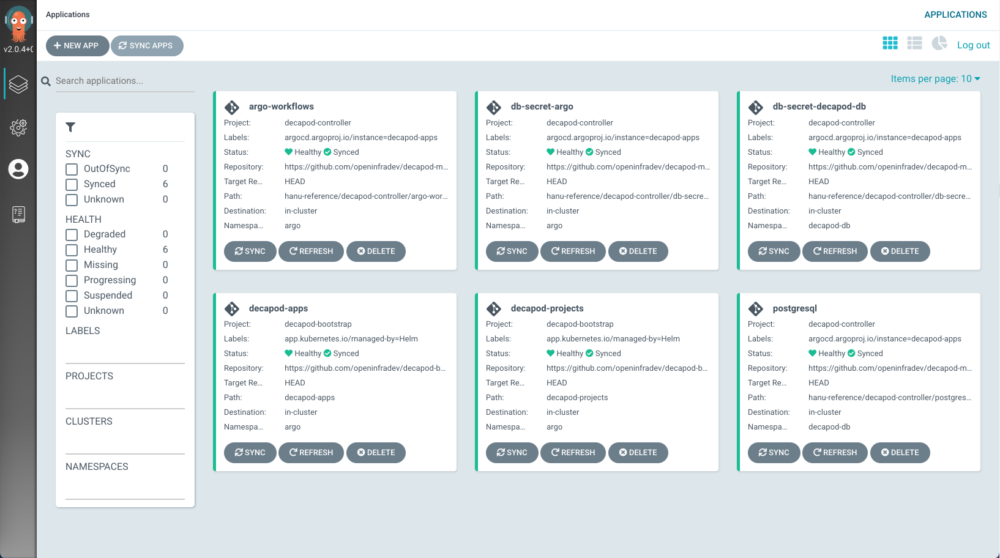

# Installation

## 사전 환경 준비
* Kubernetes Cluster >= v1.19
* 최소 200Gi 이상 사용 가능한 Kubernetes Storage Class가 있어야 한다.

## Decapod-bootstrap을 이용한 설치
Decapod-bootstrap은 [app-of-apps 패턴](https://argoproj.github.io/argo-cd/operator-manual/cluster-bootstrapping/)을 사용하여 decapod component들을 bootstrap하기 위한 프로젝트이다.
argo-cd를 설치하면서 최초의 meta app을 생성하며, 이 meta app이 실제 사용자 application을 설치해주는 구조로 되어있다.
기본적으로 최소한의 동작을 위해 다음 컴포넌트들을 설치한다.

* argo-cd
* postgresql (argo-workflow가 사용하는 DB)
* argo-workflow

### Fork & clone repository
[Decapod-bootstrap](https://github.com/openinfradev/decapod-bootstrap)을 개인 repository로 fork한 후 clone한다
```
git clone https://github.com/{YOUR_REPO_NAME}/decapod-bootstrap
```

디렉토리 구조는 다음과 같이 되어있다
```
├── README.md
├── argocd-install
│   └── values-override.yaml
├── decapod-apps
│   ├── README.md
│   ├── argo-workflows.yaml
│   ├── db-secret-decapod-db.yaml
│   ├── db-secret-argo.yaml
│   └── postgresql.yaml
└── decapod-projects
    ├── README.md
    └── decapod-controller.yaml
```

!!! note
    실제로는 'decapod-apps-template' 등 Air-gapped 환경에서의 배포를 위한 추가 파일들이 있지만 본 매뉴얼에서는 해당 부분은 제외하고, 네트워크가 연결된 온라인 환경을 기준으로 설명한다.

* argocd-install 디렉토리는 argo-cd에 bootstrap용 project 및 meta app을 생성하기 위한 argocd helm chart용 value-override file을 포함하고 있다.
* helm chart를 수행하면 argocd에 최초로 decapod-bootstrap이라는 project를 만들고, 해당 프로젝트 아래 다음의 두 application을 생성한다.
    * decapod-projects 는 실제 application용 project를 생성하기 위한 meta app으로서, `decapod-projects`라는 디렉토리를 감시하고 있다가 project manifest 파일이 추가되면 이를 감지하여 argocd project를 생성한다.
    * decapod-apps 는 실제 application을 생성하기 위한 meta app으로서, `decapod-apps` 디렉토리를 감시하고 있다가 application manifest 파일이 추가되면 이를 감지하여 argocd application을 생성한다.
```
  additionalApplications:
    - name: decapod-apps
      namespace: argo
      destination:
        namespace: argo
        server: https://kubernetes.default.svc
      project: decapod-bootstrap
      source:
        path: decapod-apps
        repoURL: https://github.com/openinfradev/decapod-bootstrap.git
        targetRevision: HEAD
        directory:
          recurse: true
          jsonnet: {}
      syncPolicy:
        automated:
          selfHeal: true
          prune: true
```

!!! note
    위의 내용은 decapod-bootstrap 프로젝트의 코드이므로 실제 사용시에는 fork한 repository의 주소로 알맞게 치환해서 사용해야 한다!

### Namespace 생성
다음의 두 namespace를 생성한다
```
$ kubectl create ns argo
$ kubectl create ns decapod-db
```

### Install argo-cd
argo-cd 차트와 위에서 준비해놓은 values-override 파일을 이용하여 argo-cd를 설치한다.  
(chart location: https://artifacthub.io/packages/helm/argo/argo-cd)  
```
$ helm repo add argo https://argoproj.github.io/argo-helm
$ helm install argo-cd argo/argo-cd --version 3.33.6 -f ./decapod-bootstrap/argocd-install/values-override.yaml -n argo
```
Argo-cd가 설치되면, decapod-projects 및 decapod-apps application이 생성되며, 이 application들이 자신이 바라보고 있는 git repo 상의 디렉토리를 스캔하여 실제 application들을 순차적으로 설치하게 된다.

!!! note
    본 가이드에서는 3.33.6 버전을 사용했지만 문제없이 잘 동작한다면 최신 버전을 사용해도 무방하다. 단, 이때 최신 버전의 chart와 values-override.yaml 파일을 잘 비교하여, 각 value들이 제대로 override되는지 확인해야 한다.

## 결과 확인
### pod 및 service 상태 확인
아래와 같이 모든 pod 의 상태가 running 상태가 되고 관련 service들이 생성되었음을 확인한다.
```
$ kubectl get pods -n decapod-db
NAME                      READY   STATUS    RESTARTS   AGE
postgresql-postgresql-0   1/1     Running   0          4m10s

$ kubectl get pods -n argo
NAME                                                           READY   STATUS             RESTARTS   AGE
argo-cd-argocd-application-controller-7bc75f949c-svrnk         1/1     Running            0          5m34s
argo-cd-argocd-dex-server-7bd494f8b5-j5br5                     1/1     Running            0          5m34s
argo-cd-argocd-redis-6f696857c5-zmqfh                          1/1     Running            0          5m34s
argo-cd-argocd-repo-server-545455798b-st5x8                    1/1     Running            0          5m34s
argo-cd-argocd-server-6666cb7689-tswfr                         1/1     Running            0          5m34s
argo-workflows-operator-server-d7df65b99-gpx5q                 0/1     Running            0          4m21s
argo-workflows-operator-workflow-controller-598dfdd565-vrzg9   0/1     Running            0          4m21s

$ kubectl get svc -n argo
NAME                                          TYPE        CLUSTER-IP      EXTERNAL-IP   PORT(S)                      AGE
argo-workflows-operator-server                NodePort    10.233.41.126   <none>        2746:31746/TCP               146d
argo-workflows-operator-workflow-controller   ClusterIP   10.233.49.96    <none>        8080/TCP,8081/TCP            146d
argocd-application-controller                 ClusterIP   10.233.27.147   <none>        8082/TCP                     146d
argocd-dex-server                             ClusterIP   10.233.59.123   <none>        5556/TCP,5557/TCP,5558/TCP   146d
argocd-redis                                  ClusterIP   10.233.31.14    <none>        6379/TCP                     146d
argocd-repo-server                            ClusterIP   10.233.46.180   <none>        8081/TCP                     146d
argocd-server                                 NodePort    10.233.23.132   <none>        80:30080/TCP,443:30443/TCP   146d
```

### web UI 접속
#### argo-cd
모든 pod 이 Running 상태가 됨을 확인후, 아래 명령어를 통해 argo-cd의 admin password 를 확인한다.
```
$ kubectl -n argo get secret argocd-initial-admin-secret -o jsonpath="{.data.password}" | base64 -d
```

argo-cd service의 nodeport(여기서는 30080)를 통하여 다음과 같이 web UI 에 접속할 수 있어야 한다.


